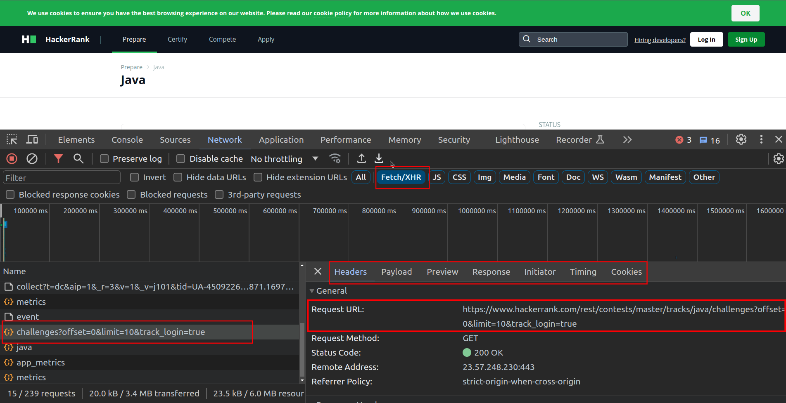

# Hackerrank 🤝 VS Code

### Solve Hackerrank challenges from VS Code itself! 🥳


## Overview

This project was an attempt to bring Hackerrrank into our good old VS Code as an extension. This extension allows us to levarage the in-built debugging tools, version control system, and infinite customizability of VS Code.

Hackerrank does not come with debugging tools and neither has direct integration with Github for version control. Snippet support is not very flexible as well. Most of the developers are much adept to VS Code and would rather prefer coding here than on the hackerrank platform. This is where this extension comes in!


## Install

1. Clone the repository locally

```bash
git clone https://github.com/Suyash-Purwar/hackerrank-vscode.git
```

2. Move inside the folder and open VS Code

```bash
cd hackerrank-vscode && code .
```

3. Press 'F5' to start the debugger. A new VS Code will open with the extension running.

## Known Issues

<details>
<summary>SEVERE: Run and Submit functionality is breaking</summary>

1. Description: The POST request on `/compile_tests` route of Hackerrank APIs expect `X-Csrf-Token` and `Cookie` header. The tokens generate on user authentication are not being accepted. However, the tokens and cookies from browser are getting accepted. I guess, Hackerrank is returning invalid token on user authentication.
2. Things I've tried:
   - Using a headless browser, Puppeteer: In headless mode, I'm not recieving any cookies whatsoever. This is most likey intentional and a security measure.s.
   - Selenium: I suspected that browser is sending some extra tokens (third-party tokens that I'm not recieving on making a GET call) or info to generate a valid `X-Csrf-Token` token. So, I thought of opening the hackerrank.com/auth/login on a browser and then fetching all the cookies (including third-party ones). This did not work unfortunately.

</details>

## How it works?

Hackerrank does not provide any out of the box API to access their platform's capabilities. I had to resort to browser inspection tools to identify what calls are being made for which data. This way I figured out the API endpoints, request and response headers, and request and response payload format.

For example, to detect a the API endpoint for fetching all the challenges for a specific topic, say Java, here's how I found the endpoint.

1. Open your browser and and press F12 to open developer tools. Go to the network tab.
2. Now, open the page for which you want to see network calls for. In my case, it's `hackerrank.com/domain/java`
3. A bunch of network calls will appear. In our case we are just looking for Fetch/XHR API calls. In the below image, I have set up a filter to show only those requests.
4. This filter shortens our list of network calls. Now, we just need to explore these calls. With some exploration, it becomes clear which call is for what.
5. Upon selecting a particular call, another pain opens which contains details for that particular call. The Header, Payload, Response, and Cookie tabs can tell us the whole anaotomy of the call.



### 1.0.0

Initial release of ...

### 1.0.1

Fixed issue #.

### 1.1.0

Added features X, Y, and Z.

---

## Following extension guidelines

Ensure that you've read through the extensions guidelines and follow the best practices for creating your extension.

- [Extension Guidelines](https://code.visualstudio.com/api/references/extension-guidelines)

## Working with Markdown

You can author your README using Visual Studio Code. Here are some useful editor keyboard shortcuts:

- Split the editor (`Cmd+\` on macOS or `Ctrl+\` on Windows and Linux).
- Toggle preview (`Shift+Cmd+V` on macOS or `Shift+Ctrl+V` on Windows and Linux).
- Press `Ctrl+Space` (Windows, Linux, macOS) to see a list of Markdown snippets.

## For more information

- [Visual Studio Code's Markdown Support](http://code.visualstudio.com/docs/languages/markdown)
- [Markdown Syntax Reference](https://help.github.com/articles/markdown-basics/)

**Enjoy!**

```

```
